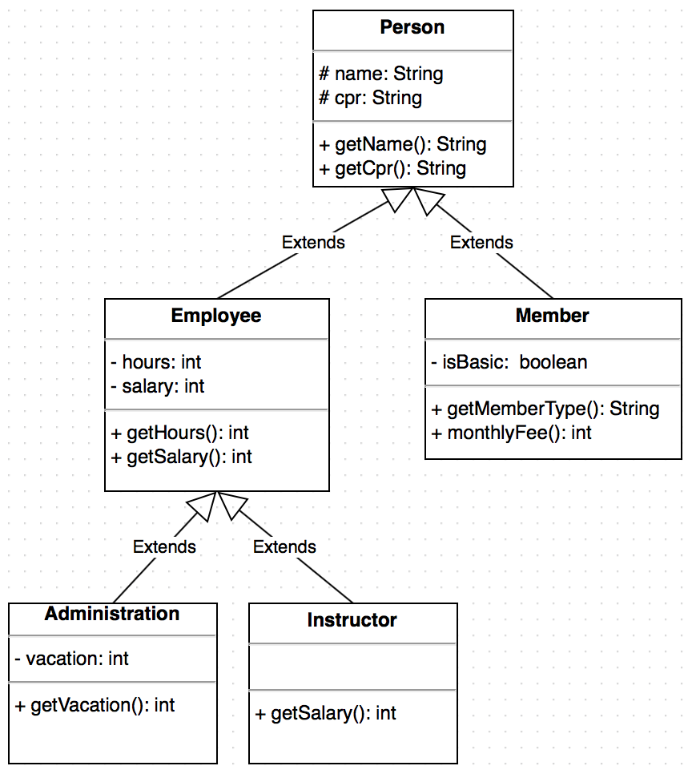
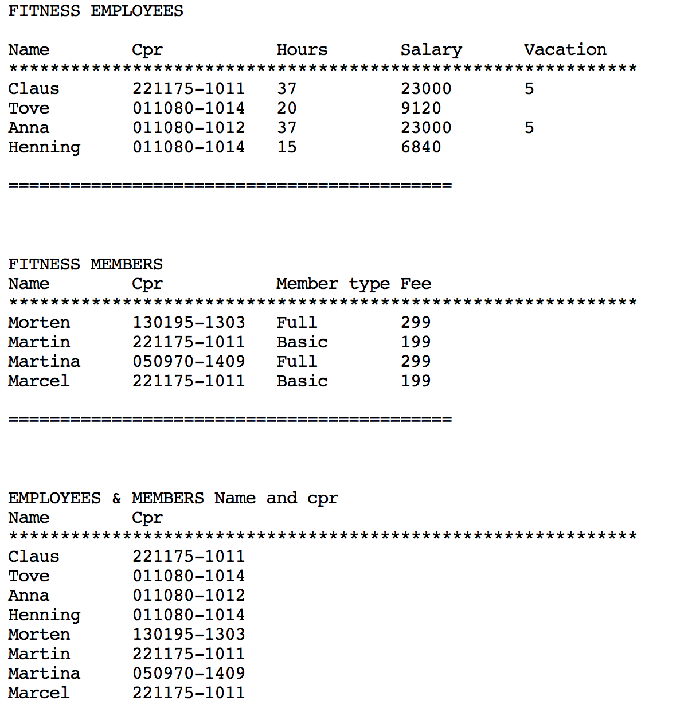
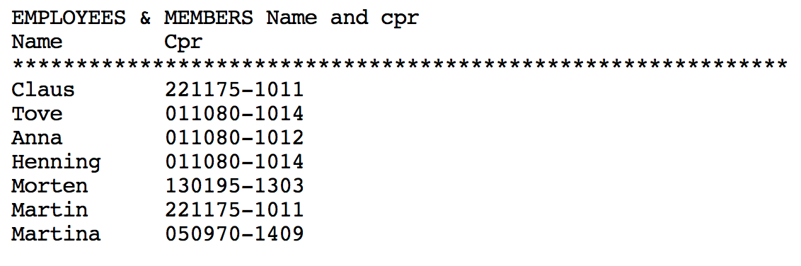

# #1: Fitness Repetition Exercise 

## Added teachers materials

* .docx, .pdf, .epub, .lyx, tex versions
* [Documents folder](/documents)

In this exercise you are going to make a program that can show lists of Employees and members of a Fitness Club.
## Employees
There are 2 types of Employees:
* Administration personnel
* Instructors    

The administration personnel are employed full time (37 hours a week), and all have a fixed salary of 23000 a month,  and have 5 weeks of vacation a year.    

Instructors a hired on an hourly basis, and are payed 199 per hour. They don't have any paid vacation.

## Members
The members can have 2 types of membership
* Basic
* Full
The Basic membership costs 199.-  a month, and the Full membership 299,- 

You should make a program that consists of the following Classes and uses inheritance in the specified way: 

Then make a file containing a main method and call the file FitnessMain.java.
In this file you should write some code that prints out something like this in your console.
(the data (names, cpr etc.) are up to you to decide, they don't have to be the same as here).

## Read data from a text file
Now make a text file named persons.txt. This file should contain the name and cpr of all employees and all members. Every person should be on a separate line and there should be a blank space between the name and the cpr number.

Make a new file called fileHandling.java and in this file should be the code for reading from the persons.txt file and adding it to an ArrayList of Person. You will have to use a Scanner Object to read from the file.
Make one method that reads from the text file and adds it to the ArrayList (this method could be private). and make a get method that returns an ArrayList of Person and call that method in your main method. Then print out the content in the console.
The console should look something like this:

If you made it this far you should be happy !!

If you feel like it you could do the same for Employees only and Members Only. Keep it “simple” and create a unique text file for each so you will end up with 3 text files: persons.txt, employees.txt and members.txt

## Xtra
Make an adjustment to the program so the user can search for a member or employee by typing the name or cpr number of a person in the console. Then show this person's data in the console.
You have to use the ArrayList method “contains” to search an ArrayList (p. 682 in the book).

## Xtra 2
Make your program able to add a new user to the text files through input from the console.
 

_
&copy; clbo@kea.dk
_
